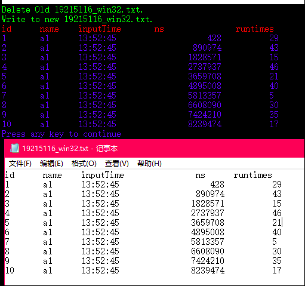

### 选修 实验一 利用 i Win Api 函数创建文件
###### 邱日\_19215116\_系统调用实验_申请成绩A
-------------------------------------------
#### 学号：19215116
#### 姓名：邱日
-------------------------------------------

#### 一、Win API 函数原型及特点说明

DeleteFile
```cpp
删除一个存在的文件。
用法
DeleteFile 方法删除指定文件。
BOOL DeleteFile(
LPCSTRlpFileName//要删除的文件名的指针
);
参数 lpFileName
必选项。要删除文件的路径。
返回值
	成功返回非零，失败返回0
	更多错误信息使用GetLastError获取。
如果程序尝试删除一个不存在的文件。GetLastError返回ERROR_FILE_NOT_FOUND。如果文件是只读 的，则GetLastError返回ERROR_ACCESS_DENIED
注：
在2000/NT/XP系统下,如果程序试图去删除一个输入输出文件或者是内存映射文件函数调用就会失败
```
WriteFile
```cpp
https://msdn.microsoft.com/zh-cn/library/windows/desktop/aa365747(v=vs.85).aspx
函数原型：
BOOL WINAPI WriteFile(
  _In_        HANDLE       hFile,
  _In_        LPCVOID      lpBuffer,
  _In_        DWORD        nNumberOfBytesToWrite,
  _Out_opt_   LPDWORD      lpNumberOfBytesWritten,
  _Inout_opt_ LPOVERLAPPED lpOverlapped
);
功能：
将数据写入指定的文件或输入/输出（I / O）设备。此功能专为同步和异步操作而设计。对于仅用于异步操作的类似功能，请参阅WriteFileEx。
```

GetModuleFileNameEx
```cpp
https://msdn.microsoft.com/en-us/library/windows/desktop/ms683198(v=vs.85).aspx
函数原型：
DWORD WINAPI GetModuleFileNameEx(
  _In_     HANDLE  hProcess,
  _In_opt_ HMODULE hModule,
  _Out_    LPTSTR  lpFilename,
  _In_     DWORD   nSize
);
功能：检索包含指定模块文件的完全限定路径。
参数
    hProcess [IN]
    句柄包含模块的过程。
    句柄必须有PROCESS_QUERY_INFORMATION和PROCESS_VM_READ访问权限。欲了解更多信息，请参阅过程安全性和访问权限。
    该GetModuleFileNameEx功能无法检索该使用加载模块的路径LOAD_LIBRARY_AS_DATAFILE标志。欲了解更多信息，请参见LoadLibraryEx。
HMODULE [在，可选]
    句柄到模块。如果该参数为NULL，GetModuleFileNameEx返回指定的进程的可执行文件的路径hProcess。
lpFileName的对象 [OUT]
    的指针，该接收到的模块完全限定的路径的缓冲器。如果文件名的大小比的值越大n大小参数，函数成功，但文件名被截断，空值终止。
n大小 [IN]
	的大小lpFileName的对象缓冲器中的字符。
返回值
    如果函数成功，则返回值指定复制到缓冲器中的字符串的长度。
    如果函数失败，返回值是零。若想获得更多的错误信息，调用 GetLastError函数。

```

GetSystemTime
```cpp
https://msdn.microsoft.com/en-us/library/windows/desktop/ms724390(v=vs.85).aspx
函数原型：
void WINAPI GetSystemTime(
  _Out_ LPSYSTEMTIME lpSystemTime
);
功能：检索当前系统日期和时间。系统时间是协调世界时（UTC）表示。  
检索当前系统日期和时间在本地时间，使用GetLocalTime功能。
参数
	lpSystemTime [OUT]
	指向一个SYSTEMTIME结构以接收当前系统日期和时间。该lpSystemTime参数不能为NULL。  
	使用NULL会导致访问冲突。
返回值
	此函数不返回值或提供扩展的错误信息。
备注
	要设置当前系统日期和时间，使用SetSystemTime函数。
例子
	举一个例子，看 SYSTEMTIME。
```

QueryPerformanceFrequency
```cpp
https://msdn.microsoft.com/en-us/library/windows/desktop/ms644905(v=vs.85).aspx
函数原型：
BOOL WINAPI QueryPerformanceFrequency(
  _Out_ LARGE_INTEGER *lpFrequency
);
功能：检索性能计数器的频率。性能计数器的频率固定在系统启动，并在所有的处理器保持一致。因此，频率只需要在应用程序初始化查询和结果可以被缓存。
参数
lpFrequency [OUT]
    的指针，该接收电流性能计数器频率，以每秒计数的变量。如果已安装的硬件不支	持高分辨率性能计数器，此参数可以为零（这不会在运行Windows XP或更高版本的系统发生）。
返回值
    如果安装的硬件支持高分辨率的性能计数器，返回值是非零。
    如果函数失败，返回值是零。若想获得更多的错误信息，调用GetLastError函数。在运行Windows XP或更高版本的系统，该功能总会成功，因此将不会返回零。
备注
	有关此功能及其使用的详细信息，请参阅获取高分辨率的时间戳。
```


-------------------------------------------

#### 二、关键函数实现流程
```cpp
static _int64 ns()
//vc6.0环境里不能支持比较位数大的类型，如long long之类，最大能支持的类
//型就是_int64了，这个函数ns()返回当前以纳秒(nanoseconds)计的时间
void to_string(string & result,const T& t)
//to_string 用了类模板，将数值类型如int之类转化成string类型
//to_string函数要用到sstream.h这个头文件（原stringstream.h较老，已弃用）
//原理是创建一个流，把值传递如流中，获取转换后的字符转并将其写入目的字符串
string getRandom1_50_str()
//getRandom1_50_str函数功能是得到1到50的随机数的对应字符串
//注意，在此次实验中，我们调用此函数的相隔时间极短，远不到1s，srand要放到循环外面。
string getid_str()
//getid_str得到id字段的字符串，设一个int型全局变量id，初始时为1，以后每调用一次，id自增1，本函数利用to_string将id转为字符串输出。
string getSystemTime_str()
//getSystemTime_str输出当前系统时间的字符串（格式例如22:50:55），这是对系统API函  
//数GetLocalTime的进一步封装，通过GetLocalTime得到wHour,wMinute,  
//wSecond分量，再分别转成字符串，连接得到显示系统时间的整体字符串。
string getFileFullPath(string myFileName)
//getFileFullPath返回文件名的全路径（string字符串类型）
void DeleteOldFile_str(string OldFileName_str)
// DeleteOldFile_str,向此函数传入一个string类型的文件名，本函数把相应文件删除。  
//这个函数是对win api函数DeleteFile的进一步封装，  
//DeleteFile要求参数是char *,这个函数利用string类型的data方法传入。  
string my_int64_to_str(_int64 aa)
//_int64是vc6.0这个环境所能支持的最大数值类型  
//要把此类型转化成string类型不能直接转换，要通过c风格的字符串char *类型来过渡一下  
//，_int64转成char,有相关内置函数_i64toa,其函数原型如下：
//char *_i64toa(_int64 value,char *string ,int radix);
void NewRecordFile(string NewFileName)
//NewRecordFile函数是顶层模块了，此函数调用以上函数，  
//完成本次实验的所有功能，删除旧文件，写新txt文件，存入十条记录。
```
-------------------------------------------

#### 三、实验测试
测试结果
```cpp
id	name	inputTime			ns		runtimes
 1	a1		22:50:55	       2137825		19
 2	a1		22:50:55	       8283538		37
 3	a1		22:50:55	      14806086		29
 4	a1		22:50:55	      18795153		19
 5	a1		22:50:55	      23314613		44
 6	a1		22:50:55	      29805508		48
 7	a1		22:50:55	      35807929		1
 8	a1		22:50:55	      41804790		12
 9	a1		22:50:55	      46832400		4
10	a1		22:50:55	      52813434		9
```

-------------------------------------------
#### 四、技术问题解决方案
##### 4_1.随机数相同的问题
###### 我的函数string getRandom1_50_str()作用是生成一个1到50的随机数并且把它变成字符串输出，windows的随机数是伪随机数，需要以时间为随机数种子，所以我把产生随机数种子的srand((int)time(0));放在函数里，然而在执行结束后，会发现所有随机数是一样的，原来srand放在循环里面，每产生一个随机数之前，都调用srand，由于计算机运行很快，这段代码总共执行不到1s，而srand()返回是以秒为单位，所以每次用time得到时间都是一样的，这相当于使用同一个种子产生产生随机序列，所以每次产生的随机数相同，于是出现所有随机数是一样的，应该把srand放在循环外面。
##### 4_2.不能对齐问题
###### 因为ns字段返回的字段长度不定，而\t的缩进是固定的，这样导致了整个表格有点歪，不能对齐，这虽然不影响功能，但是看起来很不干净。我的解决方法是这样的，把ns字段的长度固定，如果没有达到此长度，字符串在前面补空格，通过指定长度和string的size方法之间的差算出要补的空格数。
```cpp
	string temp=my_int64_to_str(recordns);
	int space_num=14-temp.size();
	for(int j=0;j<space_num;j++)
	temp=" "+temp;
	cout<<"temp"<<temp;
```
##### 4_2.大数问题
###### 我的ns()函数返回的是一个极大的数，正常的int放不下，而最新c标准支持的long long 在vc6.0环境又不支持，我想起上学期在C++实验时我曾经解决过这问题，于是又把自己当时写的报告读了一读，采用_int64来存这个大数，解决了问题。
##### 4_2.扩展功能
###### 为了演示效果，我又研究了如何调用Windows API来设置控制台文本属性SetConsoleTextAttribute，效果良好。

-------------------------------------------

#### 五、实验心得

###### 5_1.最好的文档还是微软官方MSDN的原版英文文档，应当学会利用好搜索工具，如果光靠手头上的书或者图书馆的书，根本不能很好地完成本次作业;应当学好英文，中国目前虽然有所发展，但毕竟有差距，查阅英文文档非常重要。
###### 5_2.本实验报告内容比较杂，如果用word来编辑，排版是个问题，此次我用markdown写本次报告，让我节省排版的时间来专注于内容的写作，而且排版也十分美观。好的工具能够提高效率。
###### 5_3.我认真独立完成了本实验，其间也遇到不少困难，但最后都被我一一攻克，当我初步完成要求的功能后，我发现不影响功能的对齐问题，虽然不在要求范围之内，我还是认真查阅资料，仔细思考，在尝试了诸如string的resize等方法等无果后，终于解决问题，体现了对自我的严格要求，精益求精。个人认为我较好地完成了本次实验，希望能够给予我一个A的成绩，以鼓励我以更认真的姿态继续前行。

-------------------------------------------
#### 六、参考文献
###### [1]https://msdn.microsoft.com/library/
###### 官方MSDN在线Win API手册
###### [2]https://msdn.microsoft.com/en-us/library/windows/desktop/aa365747(v=vs.85).aspx
###### [3]https://social.msdn.microsoft.com/search/en-US/windows?query=GetModuleFileNameEx&refinement=183&ac=2
###### [4]Windows+API程序设计参考大全
###### [5]http://roxlu.com/2014/047/high-resolution-timer-function-in-c-c--
###### [6]http://bbs.csdn.net/wap/topics/30140936
###### 在线请教：如何将(\_int64)类型的变量转换成string类型(Visual C++6.0)
-------------------------------------------

附录：
```cpp
#include <iostream>
#include <cstring>
#include <cstdio>
#include <sstream>
#include <cstdlib>
#include <ctime>
#include <windows.h>
using namespace std;
int id_int=1;
static _int64 ns(){
	//vc6.0环境里不能支持比较位数大的类型，如long long之类，最大能支持的类
	//型就是_int64了，这个函数ns()返回当前以纳秒(nanoseconds)计的时间
	  static _int64 is_init = 0;
//	#if defined(_WIN32)
		static LARGE_INTEGER win_frequency;
		if (0 == is_init) {
			QueryPerformanceFrequency(&win_frequency);
			is_init = 1;
		}
	    LARGE_INTEGER now;
		QueryPerformanceCounter(&now);
    return (_int64) ((1e9 * now.QuadPart)  / win_frequency.QuadPart);
//	#endif
		//printf("%I64d",ns); //调用时_int64 类型的应当用%I64d占位符来格式化输出
}
template<class T>
void to_string(string & result,const T& t){
	//to_string 用了类模板，将数值类型如int之类转化成string类型
	//to_string函数要用到sstream.h这个头文件（原stringstream.h较老，已弃用）
	//原理是创建一个流，把值传递如流中，获取转换后的字符转并将其写入目的字符串
		ostringstream oss;//创建一个流
		oss<<t;//把值传递如流中
		result=oss.str();//获取转换后的字符转并将其写入result
}
string getRandom1_50_str(){
	//getRandom1_50_str函数功能是得到1到50的随机数的对应字符串
	//注意，在此次实验中，我们调用此函数的相隔时间极短，远不到1s，srand要放到循环外面。
	const int SIZE = 50;
	int Random1_50_int=rand()%SIZE; //产生0~SIZE-1的随机数
    //srand((int)time(0));
	//srand用秒为单位，要放在循环外面，不然因为时间太短而产生的随机数相同
	string Random1_50_str;
	stringstream ss;
	ss.clear();//不clear的话，第二次用同一stringstream对象来转换就会有问题
	ss<<Random1_50_int;
	ss>>Random1_50_str;
	return Random1_50_str;
}
string getid_str(){
	//getid_str得到id字段的字符串，设一个int型全局变量id，初始时为1，以后每调用一次，
	//id自增1，本函数利用to_string将id转为字符串输出。
	string id_str;
	to_string(id_str,id_int);
	id_int++;
	return id_str;
}
string getSystemTime_str(){
	//getSystemTime_str输出当前系统时间的字符串（格式例如22:50:55），这是对系统API函数
	//GetLocalTime的进一步封装，通过GetLocalTime得到wHour,wMinute,wSecond分量，
	//再分别转成字符串，连接得到显示系统时间的整体字符串。
	SYSTEMTIME currentSysTime;
	GetLocalTime(&currentSysTime);
	string SysTimeStr;
	stringstream ss;
	//cout<<currentSysTime.wHour<<":"<<currentSysTime.wMinute<<":"<<currentSysTime.wSecond<<endl;
	ss<<currentSysTime.wHour<<":"<<currentSysTime.wMinute<<":"<<currentSysTime.wSecond;
	ss>>SysTimeStr;
	return SysTimeStr;
}
string getFileFullPath(string myFileName){
	//getFileFullPath返回文件名的全路径（string字符串类型）
	char Current_Dir[100];
	GetCurrentDirectory(100,Current_Dir);
	string dir = Current_Dir;
	string FileFullPath=dir;
	FileFullPath+="\\";
	FileFullPath+=myFileName;
	return 	FileFullPath;
}
void DeleteOldFile_str(string OldFileName_str){
	// DeleteOldFile_str,向此函数传入一个string类型的文件名，本函数把相应文件删除。
	//这个函数是对win api函数DeleteFile的进一步封装，
	//DeleteFile要求参数是char *,这个函数利用string类型的data方法传入。
	//string 转*char :方法mystr.data()
	//DeleteFile()
	DeleteFile(OldFileName_str.data());
}
//char *_i64toa(_int64 value,char *string ,int radix);
string my_int64_to_str(_int64 aa){
	//_int64是vc6.0这个环境所能支持的最大数值类型，
	//要把此类型转化成string类型不能直接转换，要通过c风格的字符串char *类型来过渡一下，
	//_int64转成char,有相关内置函数_i64toa,其函数原型如下：
	//char *_i64toa(_int64 value,char *string ,int radix);
	char buffer[32];
	string _int64_str(_i64toa(aa,buffer,10));
	//cout<<_i64toa(aa,buffer,10);
	//cout<<str;
	return _int64_str;
}
void NewRecordFile(string NewFileName){
	//NewRecordFile函数是顶层模块了，此函数调用以上函数，
	//完成本次实验的所有功能，删除旧文件，写新txt文件，存入十条记录。
	string Record;
	const int RecordNum=10;
	DeleteOldFile_str(NewFileName);
	SetConsoleTextAttribute(GetStdHandle(STD_OUTPUT_HANDLE), FOREGROUND_INTENSITY | FOREGROUND_GREEN);
	cout<<"Delete Old "+NewFileName+"."<<endl;
	cout<<"Write to new "+NewFileName<<"."<<endl;
	HANDLE hf = CreateFile(getFileFullPath(NewFileName).data(), GENERIC_WRITE, 0,
        0, CREATE_ALWAYS, 0, 0);
    DWORD written;
	string headline;
	char headline_char[100];
	sprintf(headline_char,"id\tname\tinputTime\tns\t\t runtimes\r\n");
	headline= headline_char;
	SetConsoleTextAttribute(GetStdHandle(STD_OUTPUT_HANDLE), FOREGROUND_INTENSITY | FOREGROUND_RED);
	cout<<headline;
    WriteFile(hf, "id\tname\tinputTime\t\tns\truntimes\r\n", 32, &written, 0);
	string ns_str;
	srand((int)time(0));
	_int64 initns=ns();
	for(int i=0;i<RecordNum;i++){
	_int64 currentns=ns();
	_int64 recordns=currentns-initns;

	string temp=my_int64_to_str(recordns);
	int space_num=14-temp.size();
	for(int j=0;j<space_num;j++)
	temp=" "+temp;
	//cout<<"temp"<<temp;
	Record=getid_str()+"\ta1\t"+getSystemTime_str()+"\t"+temp+"\t\t"+getRandom1_50_str()+"\r\n";
		//cout<<"size"<<my_int64_to_str(recordns).size();
	WriteFile(hf,Record.data(),Record.size() , &written, 0);
	SetConsoleTextAttribute(GetStdHandle(STD_OUTPUT_HANDLE), FOREGROUND_INTENSITY | FOREGROUND_BLUE);
	cout<<Record;
//	Sleep(1);
	}
    CloseHandle(hf);
}
int main(){
	const string myFileName="19215116_win32.txt";
	NewRecordFile(myFileName);
	return 0;
}
```
